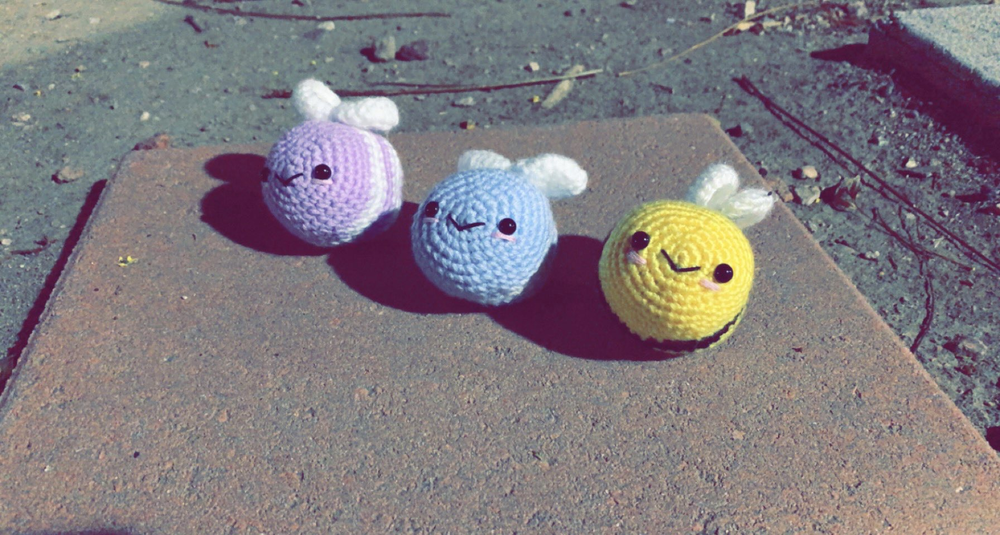

# Christine's 6.1040 Portfolio

This is my portfolio repository for 6.1040 Fall 2025.

<!-- # Template Portfolio
This will be your portfolio repository. Use this as a [template repository](https://docs.github.com/en/repositories/creating-and-managing-repositories/creating-a-template-repository) and customize it to your own tastes. We gave you a starting point with a space to describe yourself and a link to where your assignment 1 file can be. -->

# About Me

_Hello! I am Christine Wu (she/her). I'm a junior studying 6-3._

<!-- I'm involved in [MIT's Lion Dance](https://liondance.mit.edu/) team._ -->

Some fun facts about me:

1. I like to crochet. I tend to crochet amigurumis, which are small stuffed animals. Here are some bees that I crocheted before! 
2. I love to bake. I've tried baking cakes, macarons, brownies, cookies, and Chinese buns!
3. Too much chocolate gives me a headache.
4. My favorite cartoon character is [Miffy](https://www.miffy.com/) >.<

# Table of Contents

[Link to Assignment 1](assignments/assignment1.md)  
[Link to Problem Set 1](assignments/pset1.md)  
[Link to Problem Set 2](assignments/pset2.md)  
[Link to Assignment 2](assignments/assignment2.md)  
[Link to Assignment 3](https://github.com/christinew7/61040-assignment3)  
